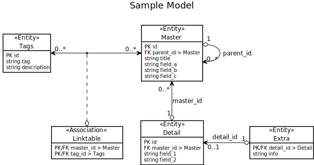

# Joomla/ORM

**Joomla/ORM** utilizes the repository pattern to encapsulate data retrieval from storage. Repositories have data mappers, which directly interact with storage, eg cache and/or a relational database. Repositories use units of work, which act as transactions across multiple repositories. The ORM does not force you to extend ORM classes in order to make them storable. You can use plain PHP objects.

## Repositories

Repositories act as collections of entities. They include methods for adding, deleting, and retrieving entities. The actual retrieval from storage is done through data mappers contained in the repository. Note that there are no methods like update() or save(). These actions take place in the data mapper and are scheduled by the unit of work contained in the repository.

## Data Mappers

Data mappers act as the go-between for repositories and storage. By abstracting this interaction away from repositories, you can swap your method of storage without affecting the repositories' interfaces.

## Units of Work

Units of work act as transactions across multiple repositories, giving you "all-or-nothing" functionality. They schedule updates, insertions, and deletions in the data mappers. Because writes are all committed at once rather than throughout the lifetime of the request, the database connection is open for less time, giving you better performance.

## Sample Model

The examples in this document, as well as the unit tests provided for the ORM, are based on this sample data model:



It contains all supported types of relations.

### Entities

#### Read a `Master`

```php
/** @var InteropContainerContainerInterface $container */
$repository = $container->get('Repository')->forEntity('Master'); 
$master = $repository->getById(42);
```

The `Master` record is read from the database, and a `Master` object is created and populated with the data.

#### Create a `Master`

```php
/** @var InteropContainerContainerInterface $container */
$repository = $container->get('Repository')->forEntity('Master'); 
$master = new Master(...);
$repository->add($master);
```

The object is registered by the ORM, so its changes are tracked internally, and written to disk automatically.

#### Update a `Master`

```php
/** @var InteropContainerContainerInterface $container */
$repository = $container->get('Repository')->forEntity('Master'); 
$master = $repository->getById(42);
$master->fieldA = 'foo';
```

The system will detect the change and save the `Master`.

#### Delete a `Master`

```php
/** @var InteropContainerContainerInterface $container */
$repository = $container->get('Repository')->forEntity('Master'); 
$master = $repository->getById(42);
$repository->remove($master);
```

The system will remove the object and delete the `Master` on disk.

## Relations

There are four different kinds of relations, that have to be supported by the ORM.

  - A `Master` can have multiple `Detail`s: **hasMany** (one to many)
  - `Master`s have many `Tag`s through a `Map`: **hasManyThrough** (many to many)
  - A `Detail` has one `Extra`. **hasOne** (one to one)
  - Many `Detail`s belong to a `Master`: **belongsTo** (many to one)

To further clarify which way around the associations are defined in the models: If the table of the model contains the foreign key (other_model_id), the relation type in this model is always a `Model` **belongsTo** `OtherModel` relation!

The expected behaviour for each relation type and CRUD operation is defined in the following sections.

### hasOne (one to one)

Example: A `Detail` has one `Extra`.

```xml
<!-- Detail.xml -->
    <relations>
        <hasOne
            name="extra"
            entity="Extra"
            reference="detail_id"
        />
    </relations>
```

- `name`: The name of the (virtual) field in this entity
- `entity`: The type of the related entity
- `reference`: The field name in the related entity pointing to this entity

```xml
<!-- Extra.xml -->
    <relations>
        <belongsTo
            name="detail"
            entity="Detail"
            reference="detail_id"
        />
    </relations>
```

- `name`: The name of the (virtual) field in this entity
- `entity`: The type of the related entity
- `reference`: The field name in this entity pointing to the related entity

#### Read the `Extra` of a `Detail`

```php
/** @var InteropContainerContainerInterface $container */
$repository = $container->get('Repository')->forEntity('Detail'); 
$detail = $repository->getById(42);
```

The `Detail` record is read from the database, and a `Detail` object is created and populated with the data. The virtual `extra` property is populated with an `Extra` object (if existent).

#### Create an extra for a `Detail`

```php
/** @var InteropContainerContainerInterface $container */
$repository = $container->get('Repository')->forEntity('Detail'); 
$detail = $repository->getById(42);
$extra = new Extra(...);
$detail->extra = $extra;
```

Since the `Detail` was fetched using the Repository, the object is known to the ORM. Its changes are tracked internally, and written to disk automatically.

#### Update the extra of a `Detail`

```php
/** @var InteropContainerContainerInterface $container */
$repository = $container->get('Repository')->forEntity('Detail'); 
$detail = $repository->getById(42);
$detail->extra->info = 'Changed information';
```

The system will detect the change and save just the `Extra`.

#### Delete the extra of a `Detail`

```php
/** @var InteropContainerContainerInterface $container */
$repository = $container->get('Repository')->forEntity('Detail'); 
$detail = $repository->getById(42);
$detail->extra = null; // or unset($detail->extra)
```

The system will detect the change and delete the `Extra`.
When a `Detail` is deleted, the associated `Extra` (if existant) will be deleted as well.

### hasMany

Example: A `Master` can have multiple `Detail`s.

```xml
<!-- Master.xml -->
    <relations>
        <hasMany
            name="details"
            entity="Detail"
            reference="master_id"
        />
    </relations>
```

- `name`: The name of the (virtual) field in this entity
- `entity`: The type of the related entity
- `reference`: The field name in the related entity pointing to this entity

```xml
<!-- Detail.xml -->
    <relations>
        <belongsTo
            name="master"
            entity="Master"
            reference="master_id"
        />
    </relations>
```

- `name`: The name of the (virtual) field in this entity
- `entity`: The type of the related entity
- `reference`: The field name in this entity pointing to the related entity

#### Read the `Detail`s of a `Master`

```php
/** @var InteropContainerContainerInterface $container */
$repository = $container->get('Repository')->forEntity('Master'); 
$master = $repository->getById(42);
```

The `Master` record is read from the database, and a `Master` object is created and populated with the data. The virtual `details` property is populated with a Repository for `Detail` objects, instead of the related `Detail`s themselves. The repository gives access to the related objects and allows all kind of filtering.

#### Create a `Detail` for a `Master`

```php
/** @var InteropContainerContainerInterface $container */
$repository = $container->get('Repository')->forEntity('Master'); 
$master = $repository->getById(42);
$detail = new Detail(...);
$master->details->add($detail);
```

The system will store the `Detail` automatically.

#### Update a `Detail` of a `Master`

```php
/** @var InteropContainerContainerInterface $container */
$repository = $container->get('Repository')->forEntity('Master'); 
$user = $repository->getById(42);
$detail = $master->details->findOne()->with(...)->getItem();
$detail->field_1 = 'Changed content';
```

The system will detect the change and save just the `Detail`.

#### Delete a `Detail` of a `Master`

```php
/** @var InteropContainerContainerInterface $container */
$repository = $container->get('Repository')->forEntity('Master'); 
$master = $repository->getById(42);
$detail = $master->details->findOne()->with(...)->getItem();
$master→details->remove($detail);
```

The system will detect the change and delete the `Detail`.

### belongsTo

Example: Many `Detail`s belong to a `Master`.

```xml
<!-- Detail.xml -->
    <relations>
        <belongsTo
            name="master"
            entity="Master"
            reference="master_id"
        />
    </relations>
```

- `name`: The name of the (virtual) field in this entity
- `entity`: The type of the related entity
- `reference`: The field name in this entity pointing to the related entity

```xml
<!-- Master.xml -->
    <relations>
        <hasMany
            name="details"
            entity="Detail"
            reference="master_id"
        />
    </relations>
```

- `name`: The name of the (virtual) field in this entity
- `entity`: The type of the related entity
- `reference`: The field name in the related entity pointing to this entity

#### Read the `Master` of a `Detail`

```php
/** @var InteropContainerContainerInterface $container */
$repository = $container->get('Repository')->forEntity('Detail'); 
$detail = $repository->getById(23);
```

The `Detail` record is read from the database, and a `Detail` object is created and populated with the data. The virtual `master` property is populated, and will contain a `Master` object.

#### Create the `Master` of a `Detail`

```php
/** @var InteropContainerContainerInterface $container */
$repository = $container->get('Repository')->forEntity('Detail'); 
$detail = $repository->getById(23);
$master = new Master(...);
$detail->master = $master;
```

The system will detect the change, create the `Master` and update the foreign key in the `Detail`. The original `Master` will not be affected.

#### Update the `Master` of a `Detail`

```php
/** @var InteropContainerContainerInterface $container */
$repository = $container->get('Repository')->forEntity('Detail'); 
$detail = $repository->getById(23);
$detail->master->field_a = 'Changed data';
```

The system will detect the change and save the `Master`.

#### Delete the `Master` of a `Detail`

```php
/** @var InteropContainerContainerInterface $container */
$repository = $container->get('Repository')->forEntity('Detail'); 
$detail = $repository->getById(23);
$detail->master = null; // or unset($detail->master);
```

If `master_id` is not required, it will be set to null on the `Detail`. Otherwise, an exception is thrown. The associated `Master` will not be affected.

### hasManyThrough

Example: `Master`s have many `Tag`s through a `Map`.

```xml
<!-- Master.xml -->
    <relations>
        <hasManyThrough
            name="tags"
            entity="Tag"
            reference="master_id"
            joinTable="map"
            joinRef="tag_id"
        />
    </relations>
```

- `name`: The name of the (virtual) field in this entity
- `entity`: The type of the related entity
- `reference`: The field name in the map pointing to this entity
- `joinTable`: The map containing pointers to both related entities
- `joinRef`: The field name in the map pointing to the related entity

```xml
<!-- Tag.xml -->
    <relations>
        <hasManyThrough
            name="masters"
            entity="Master"
            reference="tag_id"
            joinTable="map"
            joinRef="master_id"
        />
    </relations>
```

- `name`: The name of the (virtual) field in this entity
- `entity`: The type of the related entity
- `reference`: The field name in the map pointing to this entity
- `joinTable`: The map containing pounting to both related entities
- `joinRef`: The field name in the map pointing to the related entity

#### Read the `Tag`s of a `Master`

```php
/** @var InteropContainerContainerInterface $container */
$repository = $container->get('Repository')->forEntity('Master'); 
$master = $repository->getById(23);
```

The `Master` record is read from the database, and a `Master` object is created and populated with the data. The virtual `tags` property is populated with a Repository for `Tag` objects, instead of the related tags themselves. The repository gives access to the objects and allows all kind of filtering.

#### Create a `Tag` for a `Master`

```php
/** @var InteropContainerContainerInterface $container */
$repository = $container->get('Repository')->forEntity('Master'); 
$master = $repository->getById(23);
$tag  = new Tag(...);
$master->tags->add($tag);
```

The system will store the `Tag` automatically.

#### Update a `Tag` for a `Master`

```php
/** @var InteropContainerContainerInterface $container */
$repository = $container->get('Repository')->forEntity('Master'); 
$master = $repository->getById(23);
$tag  = $master->tags->getByTag('Old Label');
$tag->tag = 'Changed Label';
```

The system will detect the change and save just the `Tag`. After this action, all `Master`s associated with the `Tag` 'Old Label' will show 'Changed Label'.

#### Delete a `Tag` for a `Master`

```php
/** @var InteropContainerContainerInterface $container */
$repository = $container->get('Repository')->forEntity('Master'); 
$master = $repository->getById(23);
$tag  = $master->tags->getByTag('Old Label');
$master->tags->remove($tag);
```

The system will detect the change and delete the entry in the `Map`. The `Tag` itself will not be affected.
