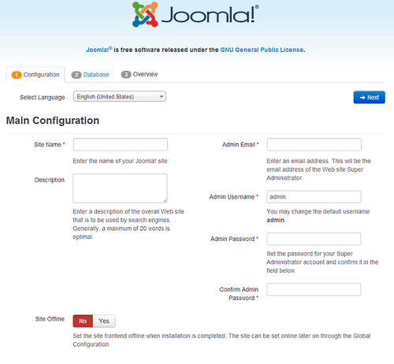

# Codeception Tests with PageObjects

This branch adds real PageObjects to Codeception tests. 
It is based on the branch `upstream` which is (should be) a copy of the current `staging` branch of the CMS.

## What are PageObjects?

PageObjects represent real pages and the functionality provided by these pages.
Since a CMS like Joomla! supports templates, the simple way of selecting elements directly using CSS or XPath is limited to a bespoke template.
The functionality used in tests is the same, however, across different templates.
That's where PageObjects come into play.
They abstract the functionality from the actual implementation.

## A simple example

The installer page allows to select a language.



Since the language selector is built with `chosen`, a more or less complex algorithm is needed to set the element to a given value.

```php
<?php

class InstallerCest
{
    // ...

    public function InstallationLanguageIsSelectable(AcceptanceTester $I)
    {
        // ...

        $select = $this->findField('Select Language');
        $selectID = $select->getAttribute('id');
        $chosenSelectID = $selectID . '_chzn';
        $I->click(['xpath' => "//div[@id='$chosenSelectID']/a/div/b"]);
        $I->click(['xpath' => "//div[@id='$chosenSelectID']//li[text()='English (United Kingdom)']"]);
        $I->wait(1); // Gives time to chosen to close

        // ...
    }
}
```

With another installation template, maybe in a newer (or older) version of Joomla!, the selection is made with a standard HTML `<select>` element.
That would require all tests using the language selector to be re-written.

The InstallerPage object, on the other hand, provides a `setLanguage()` method, that just takes the language code as an argument.
The implementation details are hidden within this method, so the very same test using this method can be used on any installation template.

```php
<?php

class InstallerCest
{
    // ...

    public function InstallationLanguageIsSelectable(AcceptanceTester $I)
    {
        // ...

        $this->page->setLanguage('en-GB');

        // ...
    }
}
```

As one easily can see, the readability of the test gets increased a lot.

## Current State

The current state of the PageObjects is not much more than a proof of concept.

## Development Environment

If you want to contribute to the PageObject development, you first need to setup your development environment accordingly.
First, you need 

  - `composer`,
  - `docker-compose`, and
  - `ant`
  
installed on your system.
Instructions for Docker on different operating systems can be found on the [Docker Engine Installation Page](https://docs.docker.com/engine/installation/).

Next,
 
  - fork this repo, and clone it to your development environment;
  - checkout the branch `feature/page-objects`;
  - run `composer install` on the command line, with the project's directory being the current working directory;
  - copy `codeception.yml.dist` to `codeception.yml`.
  
Now your environment should be ready.

## Running the Tests

The `build.xml` provides some `ant` tasks to support testing.
 
A fresh copy of the application under test (AUT) is created using the command 

```bash
$ ant reset-aut
```

You can refresh the copy at any time (eg., after modifications) with

```bash
$ ant copy-aut
```

After the test copy is created (in the 'dockyard'), the Docker containers can be started:

```bash  
$ ant docker-start
```
 
This builds and starts the containers for the webserver, the database, and Selenuim related stuff.
You can access the website at `http://localhost:8080`.

To run the tests, enter
 
```bash
$ ant system-test
```

You can repeat `copy-aut`/`system-test` as often as you need.
When you're done, you can kill the containers by typing

```bash
$ ant docker-stop
```

## Directory Layout

You'll find the PageObjects in `tests/_support/Page/Joomla3/`.
The folder `Admin/Hathor` contains outdated stuff, but also the menu and toolbar concepts, that should be ported to the new structure.
The other folders contain template-dependent PageObjects.
They are very basic at the moment, and lack a lot of necessary features.
They are merely just a proof of concept.

## Tasks / ToDo

One of the first tasks should be to define a list of PageObjects, that need to be written.
During this, it should be possible to determine, if it is possible to provide abstractions,
like `ListPage` for any admin page showing item lists.

Another one would be to provide Menu, Toolbar, and Module classes to inject into PageObjects, so common functionality does not have to be re-addressed.
